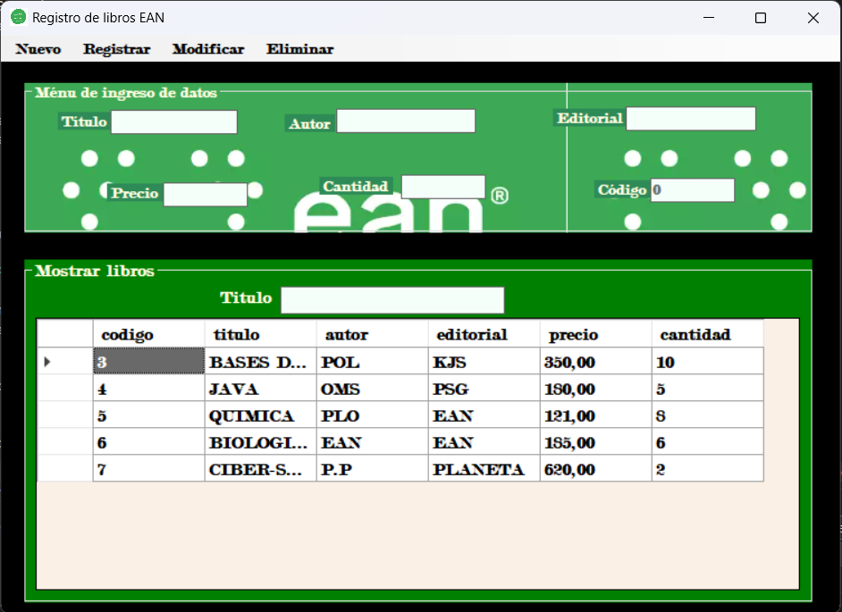

<h2 style="text-align: center;"><strong>ALMACENAMIENTO BIBLIOTECA EAN</strong></h2>

<strong>1. Agregar libro:</strong>

<strong></strong>

<strong>Interfaz dise&ntilde;ada para la Biblioteca de la Universidad EAN.</strong>

&nbsp;

<strong></strong>

&nbsp;

Registramos el libro ciber-seguridad en la base de datos.

<strong></strong>

&nbsp;

Observamos que se registra el libro en el data grid view satisfactoriamente.

&nbsp;

<strong>2. Modificar libro:</strong>

<strong></strong>

&nbsp;

Modificamos la cantidad del libro 'JAVA' a 3.

Y vemos que se efectua el cambio en la base de datos.

&nbsp;

<strong>3. Eliminar libro:</strong>

<strong></strong>

&nbsp;

Seleccionamos el libro que queremos eliminar.

&nbsp;

Vemos que se elimina el libro ciber-seguridad

